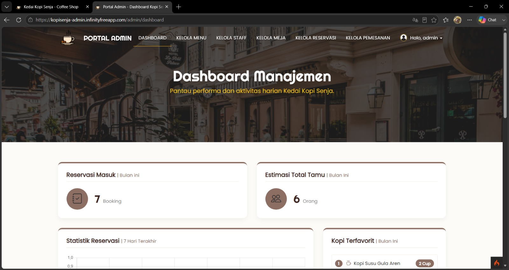
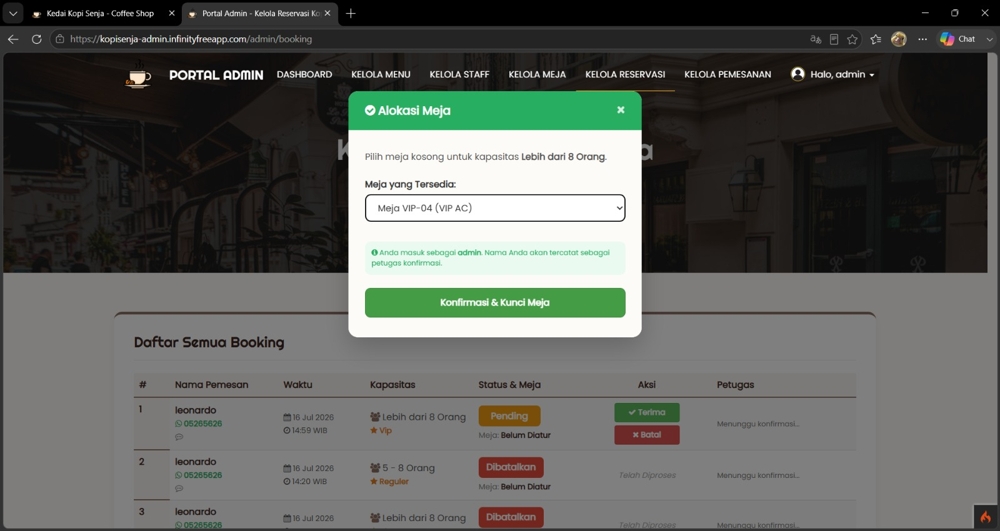
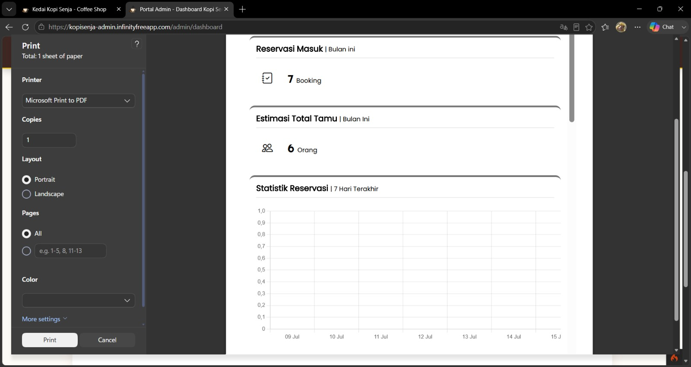
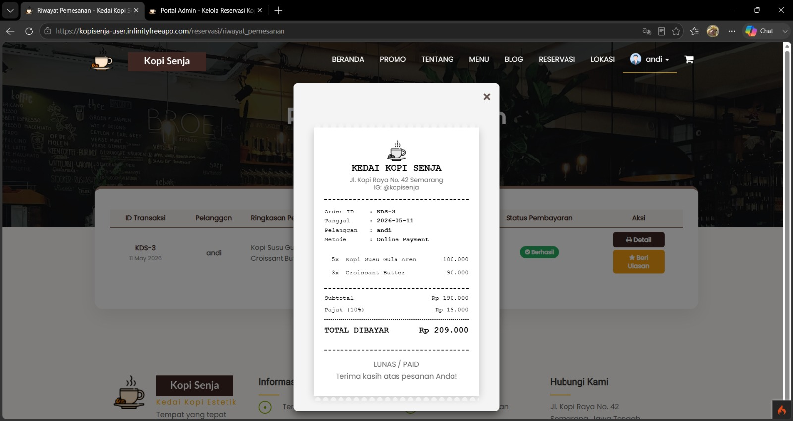
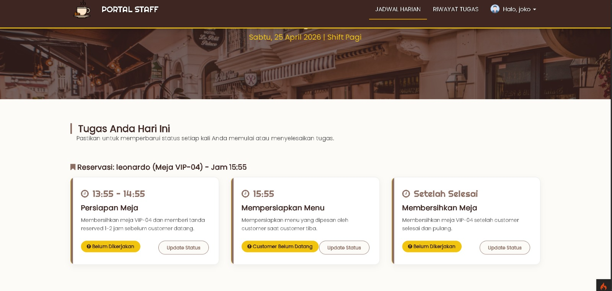
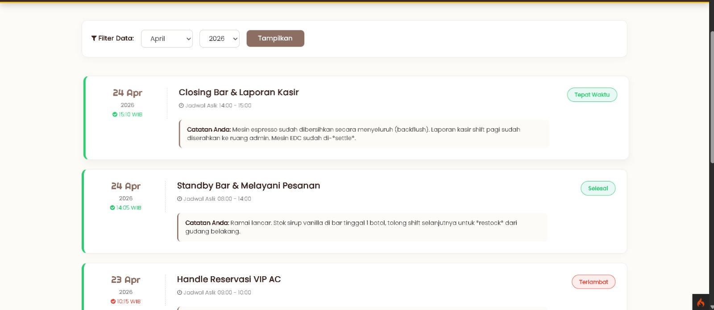

# ☕ Kedai Kopi Senja - Admin Dashboard

Ini adalah repositori untuk sisi **Admin dan Staff** dari sistem informasi Kedai Kopi Senja. Aplikasi ini berfungsi sebagai pusat kendali (CMS) untuk manajemen menu, pengaturan meja, pemrosesan reservasi, hingga pengelolaan pengguna dan pelaporan.

---

## ✨ Fitur Utama

- **Manajemen Menu & Meja:** Mengatur ketersediaan dan harga.
- **Kelola Reservasi:** Memantau dan menyetujui pesanan/reservasi pelanggan.
- **Cetak Laporan & Struk:** Pembuatan laporan penjualan dan pencetakan struk transaksi.
- **Role Management (Admin & Staff):** Pembagian hak akses dan pelacakan riwayat tugas.

---

## 🚀 Cara Instalasi

Ikuti panduan berikut untuk menjalankan dasbor admin ini di _local environment_ Anda:

### 1. Persiapan Repositori

Lakukan _clone repository_ ini ke direktori lokal Anda:

```bash
git clone [https://github.com/Nardo4577/toko_kopi_admin.git](https://github.com/Nardo4577/toko_kopi_admin.git)
cd toko_kopi_admin
```

### 2. Instalasi Dependensi

Jalankan perintah berikut untuk mengunduh semua _library_ CodeIgniter 4 yang dibutuhkan:

```bash
composer install
```

---

## ⚙️ Konfigurasi Lingkungan (`.env`)

Untuk alasan keamanan, _file_ `.env` tidak disertakan di GitHub. Anda harus mengaturnya secara manual.

1. Salin _file_ _template_ dan ubah namanya menjadi `.env`:
   ```bash
   cp env.example .env
   ```
2. Buka _file_ `.env` dan atur konfigurasi koneksi _database_ Anda. Pastikan modenya diatur untuk _development_:

```env
CI_ENVIRONMENT = development

database.default.hostname = localhost
database.default.database = toko_kopi
database.default.username = root
database.default.password =
database.default.DBDriver = MySQLi
```

---

## 🗄️ Pembuatan Database, Migrations & Seeder

Agar aplikasi dapat berjalan, Anda wajib membuat _database_ terlebih dahulu sebelum CodeIgniter 4 dapat mengeksekusi pembuatan tabel.

### Langkah 1: Membuat Database Baru

Anda bisa membuat _database_ menggunakan antarmuka grafis atau melalui terminal.

**Opsi A: Menggunakan phpMyAdmin (XAMPP/MAMP)**

1. Buka _browser_ dan akses `http://localhost/phpmyadmin`.
2. Klik menu **Baru (New)** di _sidebar_ sebelah kiri.
3. Masukkan nama _database_ persis seperti di file `.env`: `toko_kopi`.
4. Klik tombol **Buat (Create)**.

**Opsi B: Menggunakan Terminal (MySQL CLI)**
Buka terminal/Command Prompt, masuk ke sistem MySQL Anda, lalu jalankan perintah SQL berikut:

```sql
CREATE DATABASE toko_kopi;
```

### Langkah 2: Menjalankan Migrasi dan Seeder

Setelah _database_ `toko_kopi` berhasil dibuat, kembali ke terminal _project_ Anda. Jalankan perintah berikut untuk membangun struktur tabel secara otomatis dan mengisi data awal (_dummy_):

```bash
php spark migrate
php spark db:seed App\Database\Seeds\KopiSenjaSeeder
```

---

## 🔐 Akun Demo (Akses Dasbor)

Gunakan akun referensi berikut untuk masuk ke sistem dan menguji keseluruhan fitur dasbor:

- **Username:** `admin`
- **Password:** `admin123`

---

## 📸 Tampilan Antarmuka (Screenshots)

Berikut adalah pratinjau dari fitur-fitur utama pada dasbor Admin dan Staff:

### Halaman Dashboard Admin



### Halaman Manajemen Kelola Reservasi



### Halaman Cetak Laporan



### Halaman Cetak Struk Transaksi Pelanggan



### Halaman Dashboard Staff



### Halaman Riwayat Tugas Staff


