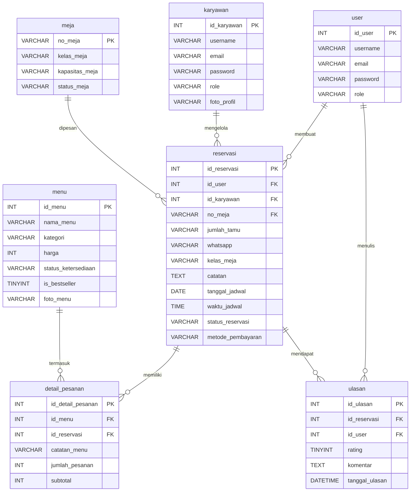

# Kopi Senja - Admin & Staff Management System

Sistem manajemen reservasi, pemesanan, dan inventaris untuk Kopi Senja, dibangun menggunakan CodeIgniter 4.

## 📋 Entity Relationship Diagram (ERD)



## 🚀 Cara Install

1. **Clone repository ini**
   Pastikan Anda telah menginstal Git, kemudian clone ke folder web server Anda (contoh: `htdocs` untuk XAMPP atau `www` untuk WAMP).

2. **Install Dependensi dengan Composer**
   Buka terminal/command prompt di direktori project, lalu jalankan:
   ```bash
   composer install
   ```

3. **Konfigurasi Environment**
   - Copy file `env` menjadi `.env`.
   - Buka file `.env` dan ubah environment menjadi development:
     ```env
     CI_ENVIRONMENT = development
     ```
   - Konfigurasi koneksi database Anda di bagian `database.default`:
     ```env
     database.default.hostname = localhost
     database.default.database = nama_database_anda
     database.default.username = root
     database.default.password = 
     database.default.DBDriver = MySQLi
     ```

4. **Jalankan Migrasi Database dan Seeder**
   Untuk membuat tabel beserta data awal, jalankan perintah berikut di terminal:
   ```bash
   php spark migrate
   php spark db:seed KopiSenjaSeeder
   ```

5. **Jalankan Server Lokal**
   Gunakan server bawaan CodeIgniter untuk menjalankan aplikasi:
   ```bash
   php spark serve
   ```
   Aplikasi dapat diakses melalui browser di alamat: `http://localhost:8080`

---
*Dibuat menggunakan CodeIgniter 4*
